# Pokédata

# ¿Qué es Pokemon GO? 🤷‍

Antes de comenzar con la explicación de nuestra página es importante señalar en primera instancia el juego en el que nos inspiramos para crearla.
Pokémon GO es un videojuego de realidad aumentada basado en la localización, desarrollado por la empresa Niantic cuyo dueño fue creador de Google maps. Es un juego casual para dispositivos iOS y Android. Es videojuego gratuito, contiene microtransacciones. Pokémon GO está creado en la plataforma de juego del mundo real de Niantic y utiliza ubicaciones reales de GPS para animar a los jugadores a que salgan a explorar para capturar Pokémones.

# ¿Que es Pokedata?👩‍🏫

Pokedata es una aplicación web responsiva que fue creada y pensada en aquellos jugadores del juego Pokemon GO que recién están adentrándose en el universo pokemon y buscan información al momento de elegir sus pokemones ya que de esta manera estarán mejor preparados para sus enfrentamientos.

# Información sobre el proceso

Luego de leer y comentar los requisitos del proyecto, lo primero que realizamos fue una lista de tareas, ordenadas en base a las prioridades necesarias para cumplir con lo requerido. De acuerdo a nuestra lista de tareas realizada en Trello.
## Planificación📌

[Clic aquí para ver planificación](https://trello.com/b/7o0XmKMJ/data-lovers-pokemon) 

Luego de realizar nuestra planificación comenzamos con las entrevistas, para así obtener nuestras Historias de Usuario, y tener una idea mas clara de como debía ser nuestra aplicación.

El primer paso fue la realización de un diagrama de flujo.

## 1 Diagrama de flujo✍🏻

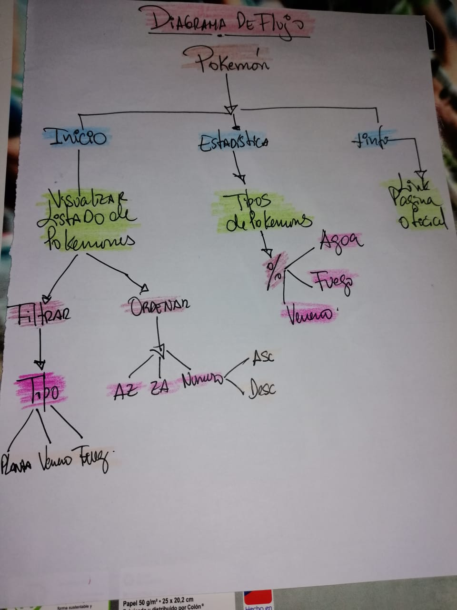

Seguido de esto construimos un prototipo de baja fidelidad que nació de la imaginación del equipo como el reflejo de lo que podría ser una buena página que contenga información sobre pokemones. Fue modificado con posterioridad luego de recibir feedback y sugerencias de nuestra compañeras.

## 2 Primer prototipo de baja fidelidad

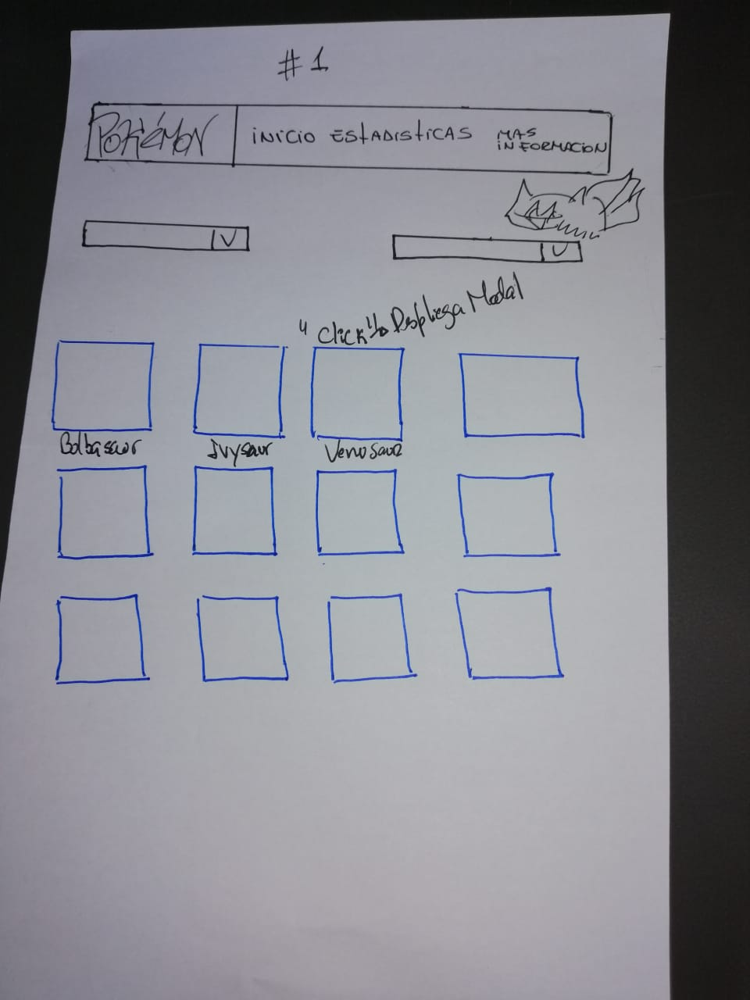

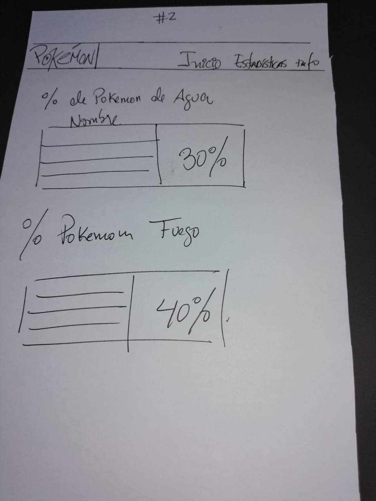

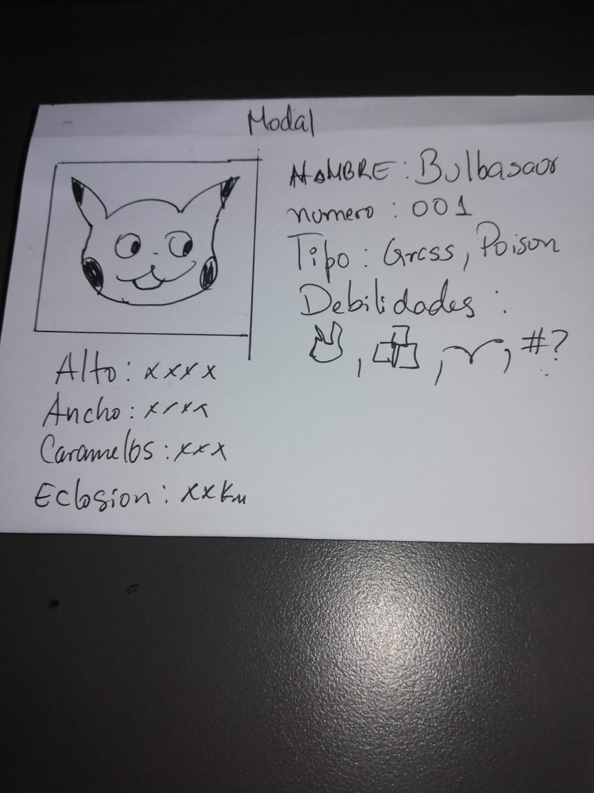

## 3 Segundo prototipo de baja fidelidad

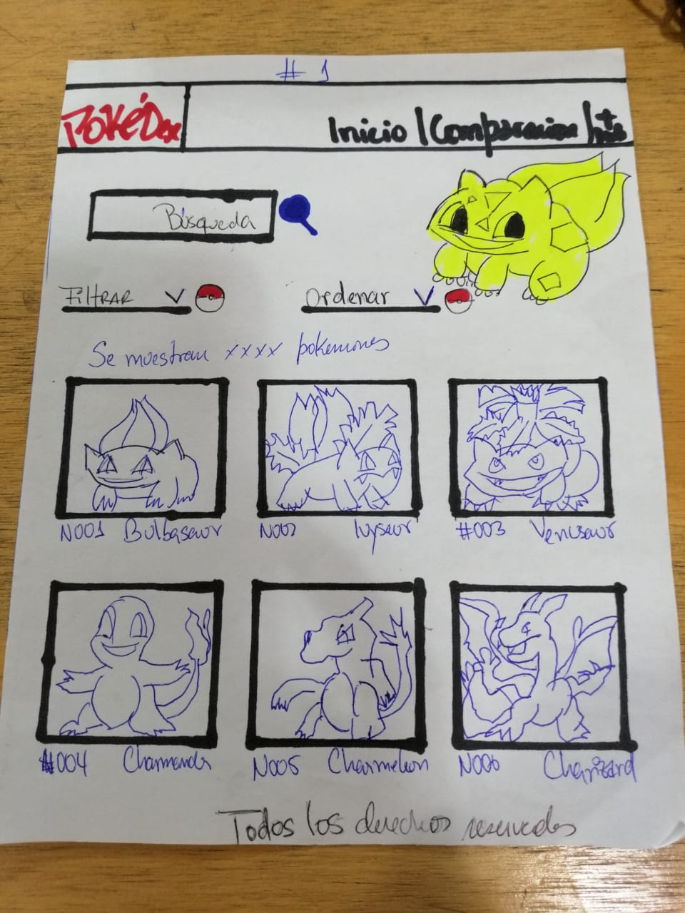

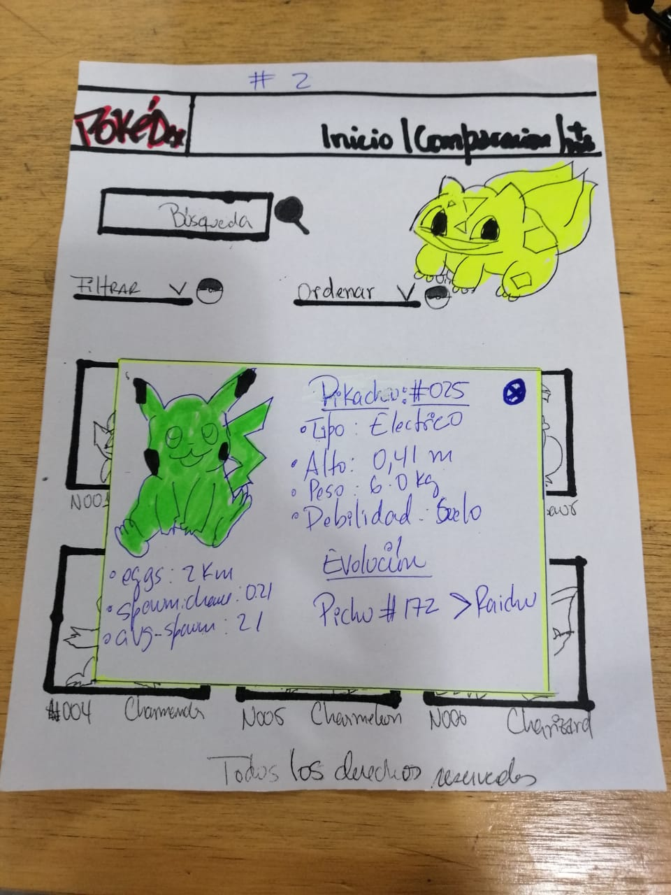

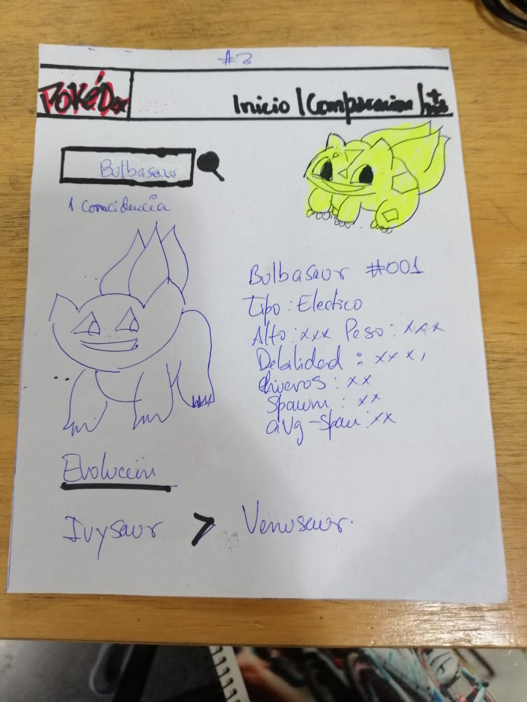

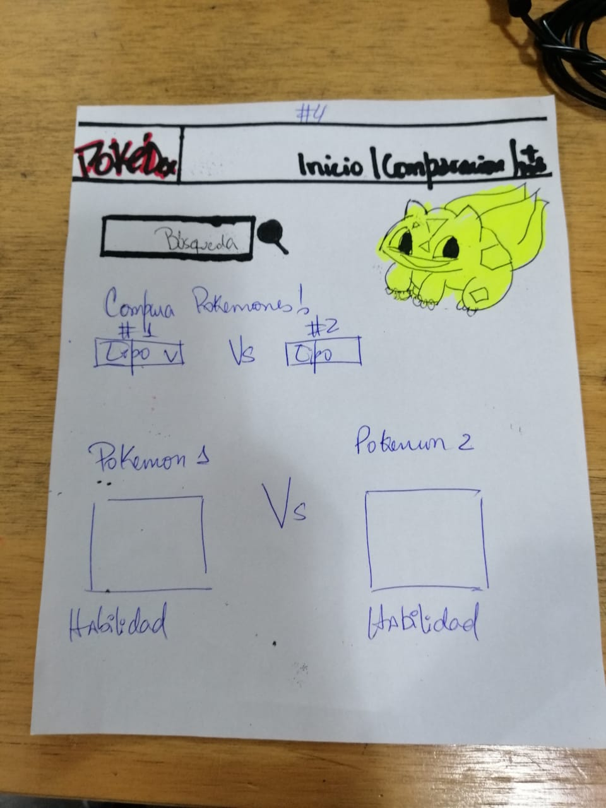

Por otro lado realizamos un prototipo de alta fidelidad en figma que fue nuestra guía para comenzar con la elavoración de la página.

# Prototipo de alta fidelidad

[Clic aquí para ver prototipo de alta fidelidad en figma](https://www.figma.com/file/WUvV6OsTJVs2rOzWKksQF9jo/datalovers-Colors?node-id=85%3A0)

[Clic aquí para ver prototipo de alta fidelidad en zeplin](zpl.io/a7W1dov)

# Encuesta 📊

Además realizamos una encuesta en línea para informarnos de los aspectos que debería considerar nuestra página, tomando en cuenta que debíamos filtrar, ordenar y calcular.
La encuesta reflejó que los usuarios esperan ver los nombres de cada pokémon, también ,consideran relevante un filtro por tipo de pokémon y quieren información de como conseguir que eclosionen los huevos. Dicha encuesta no proporcionó suficiente información ya que consideramos que no realizamos bien las preguntas desde el principio, por lo mismo y basándonos en el aprendizaje que nos dejó la mala formulación de preguntas en dicha encuesta, decidimos hacer testeo con la página en funcionamiento y con la información obtenida implementamos mejoras tanto en diseño como en funcionamiento.

[Clic aquí para ver encuesta](https://docs.google.com/forms/d/1Hx50ndrGJxEoFttq1uDXe0O-Y0F3yDBKP0_1mGCalLY/edit#responses)

# Historias de usuario

## Historia de usuario 1

YO COMO usuario nuevo del juego QUIERO poder ver todos los pokemones para visualizar la lista de todos los pokemones que existen.

## Historia de usuario 2

YO COMO jugador novato de pokémon go QUIERO poder filtrar mi pokémon por tipo PARA ver sus características.

## Historia de usuario 3

YO COMO usuario nuevo de pokémon go QUIERO poder ordenar los pokemones por número o alfabéticamente para ubicar el personaje mas rápido.

## Historia de usuario 4

YO COMO usuario principiante QUIERO saber cuantos pokemones hay de tipo agua para completar mi colección de pokemones de ese tipo.

## Historia de usuario 5

YO COMO usuario nuevo QUIERO saber cuántos kilómetros caminar para que mi huevo nazca y poder tener un nuevo pokémon.

# Objetivos de la aplicación

- Entrar a la plataforma directamente sin necesidad de loguearse o ingresar datos personales .

- Visualizar Pokémones directamente al entrar en la página.

- Clasificar y filtrar pokémones según los deseos del usuario para acceder mas fácilmente a alguna característica específica como:

* Filtrar pokémon por tipo según desee el usuario.

* Ordenar pokémon por número del 1 al 151 y viceversa.

* Ordenar pokemon de A a Z y viceversa.

* Realizar cálculo de cantidad de pokémones que tienen  
  huevos.

# Testeos de usabilidad de primer diseño de interfaz

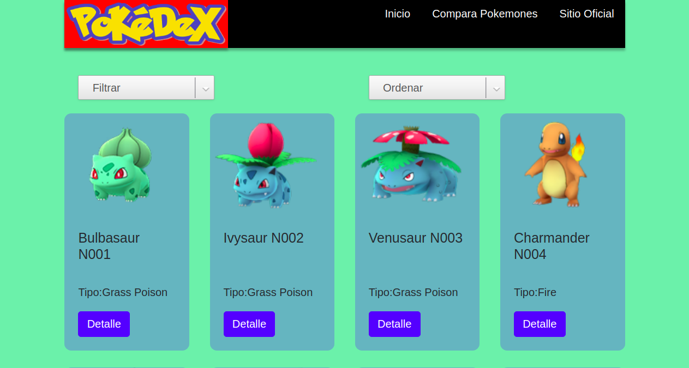

### A continuación algunos de los videos de nuestro test de usabilidad con los cuales comenzamos a realizar los cambios finales.📷

[Clic aquí para ver video 1](https://www.youtube.com/watch?v=jqEzKbV3CJE&t=4s)

[Clic aquí para ver video 2](https://www.youtube.com/watch?v=urbgxaAD7UY)

[Clic aquí para ver video 3](https://www.youtube.com/watch?v=juWHDOijrNU&t=18s)

[Clic aquí para ver video 4](https://www.youtube.com/watch?v=0Px_2PRhH8w)

# Resultados de test de usabilidad
## En base a los testeos de usabilidad se pudo obtener las siguientes impresiones de los usuarios:

* No queda claro el botón filtrar, se debe indicar que es lo que se esta filtrando.

* Los botones deben ser más llamativos.

* Los colores del header junto con el color del logo no se complementan.

* Se sugiere armonizar los colores en la página y modificar tamaño de logo.

* El botón detalle no esta operativo.

* Falta un botón que nos permita volver al principio de la página porque no resulta cómodo tener que usar el scroll para ir al principio dada la cantidad de elementos.

* No queda claro a que se refiere el orden ascendente y descendente, se debería indicar que se ordena por número.

* El botón que permite ordenar los pokemones debería decir "ordenar" e indicar que es lo que se ordena o de que manera se realiza el orden.

* No se entiende claramente la finalidad de la página ya que no posee un título o alguna explicación que nos ayude a entender de que se trata la página.

* Los elementos del filtro se sugiere sean en español para aquellos usuarios que no hablan inglés.

# Soluciones

Posterior a los testeos con usuarios se procedió a integrar colores, imágenes y detalles en cuanto a diseño visual y uso de la página. 

* Agregamos al seleccionador que filtra la palabra tipo para que el usuario identifique ,que ahí puede filtrar a sus pokemones segun tipo que prefiera.

* Cambiamos el tipo de select ,para hacerlos mas visibles

* Armonizamos el color del header junto con el color del logo, ya que no eran agradables visualmente.

* Le dimos funcionalidad al botón detalle. Que actualmente nos muestra más información sobre el pokemon que el usuario quiera conocer.

* Modificamos las opciones del seleccionador ordenar en vez de decir ascendente y descendente,indicamos que se ordena de 1 a 151 y viceversa (151 a 1).

* En el select que ordena, se clarifica que el orden es de A-z y de z-A

* Cambiamos las opciones de filto por tipografía en español para aquellos usuarios que no hablan inglés.

# Desarrollando iteración 

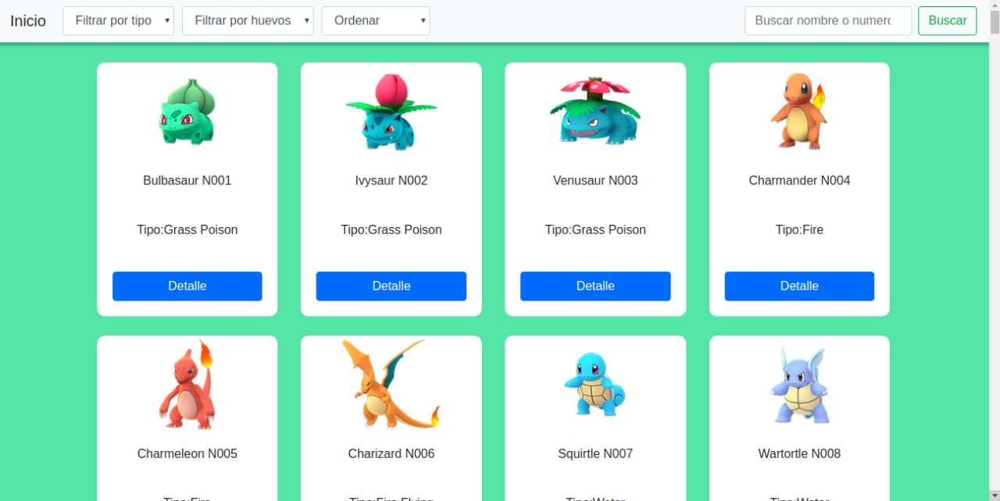

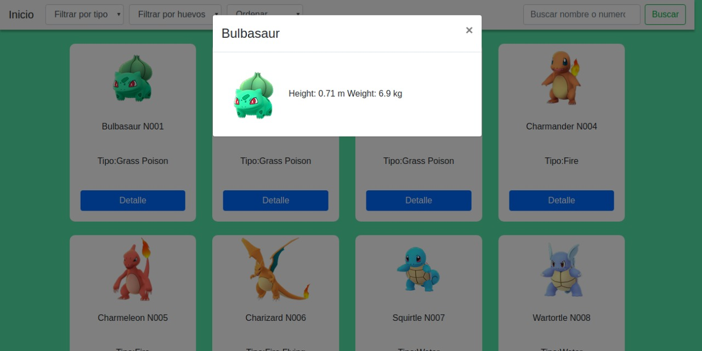

# Nuestro producto final

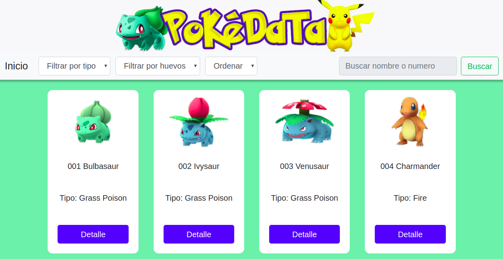

# Pruebas unitarias

Filtrar Ordenar Calcular

# Consideraciones técnicas
La lógica del proyecto esta implementada completamente en JavaScript, HTML y CSS.

# Herramientas
- Git
- GitHub
- GitHub Pages
- HTML5 
- CSS3
- Vanilla JS
- Node.js
- Mocha
- Bootstrap 4.

# Estudio y aprendisaje

El trabajo que se debe realizar en esta área es muy amplio y en ocaciones desconocido ya que siempre se puede incorporar nuevas formas de hacer las cosas o de recopilar la información de estudio de los usuarios.
En nuestro proyecto nos enfocamos en usuarios principiantes,que necesitan obtener información sobre algún pokémon,
idealmente hubiesemos esperado poder realizar nuestros testeos con participantes  que tengan perfiles y características acordes con la audiencia potencial del sitio web, en honor al tiempo,buscamos personas que se encontraran disponibles e intentamos definir tareas claras al momento de testear para facilitar la medición, en relación a: efectividad,eficiencia y satisfacción.

# Sigamos iterando 

## Evaluación heurística✅

Realizamos evaluación heurística para identificar el impacto.

(https://docs.google.com/spreadsheets/d/14uXW7RtJZMW6myO9fwg7D5ODgg0K8QHuK-21hD4owy0/edit#gid=0)

# Nuevos testeos con usuarios🎥

[Clic aquí para ver video 1](https://www.youtube.com/watch?v=3IHbAmv4E30)

[Clic aquí para ver video 2](https://www.youtube.com/watch?v=BJ_G8_QR0qg)

[Clic aquí para ver video 3](https://www.youtube.com/watch?v=gccgfRBrgu0)

[Clic aquí para ver video 4](https://www.youtube.com/watch?v=Qxn4vcfuFEc)

[Clic aquí para ver video 5](https://www.youtube.com/watch?v=Fn6AE3M410M)

[Clic aquí para ver video 6](https://www.youtube.com/watch?v=RnTxelW-hMk)

# Informe de resultados Y mejoras a aplicar en la siguiente iteración📂

Identificamos  que los usuarios responden de manera satisfactoria y clara sin grandes demoras a las siguientes tareas:
  * Quiero poder ver los pokemones de tipo agua,fuego, etc,les queda claro que deben ir al select que filtra por tipo.
  
  * Cuando se pide ver pokemon por orden alfabético, intuyen que deben ir al select que ordena y luego buscan la opción.

  * Cuando se pide ver más información de un pokémon, entienden que deben ir al botón detalle.
  
  * Cuando se pregunta para que usarían el botón de inicio, indican que se entinde que es para regresar a la primera vista de la página.

  * Cuando se consulta sobre buscar un pokémon específico, los usuarios indican que escribirían el nombre del pokemon y luego presionarían el botón buscar.

  * Respecto al filtro por huevo, cuando se consulta por los pokemones que no tienen huevos, el usuario identifica que debe ir al select de filtrar por huevo y elegir la opción "sin huevo".Pero no comprenden por que aparecen kilometros al filtar por huevo,el usuario no intuye que cada cierta cantidad de kilometros nace un huevo, en este caso creemos que al modificar el nombre que aparece en el select indicando "nace pokemon a.." y las mismas opciones de kilometros ,de esta forma el usuario comprenderá que a esa cierta cantidad de kilometros nacera un huevo.

  El usuario requiere de un título o reseña que haga referencia a la utilidad de la página, consideramos agregar un título que diga "conoce tu pokemon y sus características".

  La sección buscar por número o nombre no está en funcionamiento, por lo que trabajaremos en ello, ya que al consultar al usuario, manifiesta entender qué hacer y cómo buscar y le resulta útil y más rápido el buscar directamente por nombre o número el pokémon.

# Cómo el producto soluciona los problemas/necesidades de los usuarios.🙂

Para identificar como el producto soluciona necesidades en los usuarios, nos basamos en las historias de los mismos priorizando aquellas necesidades de mayor interés en las que se destacan:

* Mostrar todos los pokemones con sus respectivos nombres y características

* Filtro por tipo de pokemonn

* Orden por número  del 1 a 151 y viceversa

* Orden por alfabeto de A-Z  y de Z-A 

* Filtrar por huevo

* Filtrar por nacimiento de huevo

* Conocer estadísticas de porcentaje de pokemones por tipo y distancia que se debe recorrer para que un huevo nazca.

# Conclusión de final

Si bien logramos  integrar soluciones a nuestra aplicación, esperamos seguir interando para solcucionar aquellos problemas o falencias detectadas en los últimos testeos realizados para lograr un mejor producto y experiencia de usuario.
 

Estudio realizado por

Dayana Mateluna
